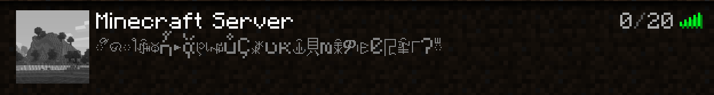

# I see the player you mean

## Description 
3.105.169.187

**Category:** Misc

**Difficulty:** Medium

**Author:** Jamie

**Flag:** `AHOY{1t_read5_0ur_th0ught5}`

## Exploit
Step by step guide

* Nmap the ip. `-Pn` is required since it doesn't respond to pings, and `-p-` is required to enable all ports since the one we're looking for isn't in the top 1000 which nmap searches by default:

```
PORT      STATE SERVICE
25565/tcp open  minecraft
```

* (Optional) Observe that if you try to connect to the server in Minecraft, it fails - you are not whitelisted. However, if you add the server to your server list, you can see its status message, but the text is garbled:



This is due to the presence of a `§k` ("obfuscated") [format specifier](https://minecraft.fandom.com/wiki/Formatting_codes) in the MOTD.

You could probably dump the text out of the real Minecraft client somehow, but the intended solution is:

* Use an external tool to grab the MOTD text, which does not render the formatting character. 

The protocol is [documented](https://wiki.vg/Server_List_Ping), so many implementations are available - e.g. https://mcsrvstat.us/server/3.105.169.187

Alternatively, use nmap with -sV, which will grab the MOTD status text directly!

```
Starting Nmap 7.92 ( https://nmap.org ) at 2022-08-12 00:29 NZST
Nmap scan report for ec2-3-105-169-187.ap-southeast-2.compute.amazonaws.com (3.105.169.187)
Host is up (0.045s latency).

PORT      STATE SERVICE   VERSION
25565/tcp open  minecraft Minecraft 1.19.2 (Protocol: 127, Message: kAHOY{1t_read5_0ur_th0ught5}, Users: 0/20)
```
